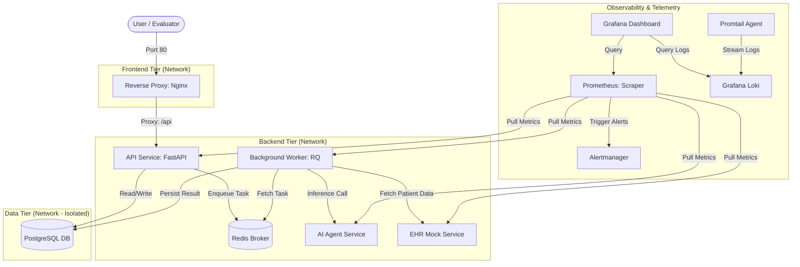

# Secure, Reliable & Scalable Infrastructure for AI Healthcare Platform
### DevSecOps Technical Assessment & Local Cloud Simulation


A production-grade, local DevSecOps infrastructure simulation built with **Terraform**, **Docker Compose**, **PowerShell**, and **Python**. It features a 3-tier isolated network model, zero-trust container security, an automated observability stack, self-healing queues, zero-downtime deployment rollbacks, and automated disaster recovery..

---

## 🏛️ System Architecture

The architecture enforces strict network isolation across three segregated Docker networks managed through **Terraform IaC**:



---

## 🚀 Key Highlights & DevSecOps Capabilities

* **Infrastructure as Code (IaC)**: Modular Terraform (`infra/modules/network`, `infra/modules/volumes`) managing Docker networks (`frontend-tier`, `backend-tier`, `data-tier`) and persistent volumes for dev and prod environments.
* **Tiered Network Isolation**: PostgreSQL and Redis are placed in an isolated `data-tier` unreachable directly from external ingress.
* **Hardened Containers**: Minimalist `python:3.11-slim` base images running under non-root users (`USER appuser`) with native Docker health checks.
* **Full Observability Stack**:
  * **Prometheus**: Metric collection across all services (`/metrics`).
  * **Grafana**: Pre-provisioned dashboards for Request Rate (RPS), p95 Latency, 5xx Error Rates, and Redis Queue Depth.
  * **Alertmanager**: Configured firing rules for queue backpressure, high error rates, and API latency.
  * **Loki & Promtail**: Centralized log streaming and aggregation.
* **Automated Resilience & Chaos Scenarios**:
  * **Traffic Load Test**: Concurrency stress testing with real-time metric visualization.
  * **Worker Failure & Self-Healing**: Demonstrates queue backpressure in Redis and automatic backlog drainage on worker recovery.
  * **External Dependency Failure**: Simulates EHR downstream 503 outages and circuit breaking.
  * **Safe Deployment & Rollback**: Health-gated rollout script that detects broken builds and automatically rolls back without downtime.
* **DevSecOps Security Pipeline**:
  * **Gitleaks**: Secrets scanning to prevent credential leakage.
  * **Trivy**: CVE scanning across container images and filesystem dependencies.
  * **tfsec**: Static analysis and policy scanning on Terraform configurations.
* **Disaster Recovery**: Automated, timestamped PostgreSQL backup and restore scripts.

---

## 📋 Directory Structure

```text
devsecops-assessment/
├── .github/workflows/          # Multi-stage CI/CD workflow (Gitleaks, Trivy, tfsec, Tests)
├── config/                     # Service and observability configurations
│   ├── alertmanager/           # Alertmanager routing and alert rules
│   ├── grafana/provisioning/   # Pre-provisioned dashboards and datasources
│   ├── loki/                   # Grafana Loki configuration
│   ├── nginx/                  # Nginx reverse proxy configuration
│   ├── prometheus/             # Prometheus scrape targets and alerting rules
│   └── promtail/               # Promtail log shipping config
├── docs/                       # Comprehensive documentation
│   ├── architecture.md         # Detailed architectural breakdown & threat model
│   ├── demo-runbook.md         # Step-by-step demonstration walkthrough
│   ├── deployment.md           # Zero-downtime deployment strategy
│   ├── incident-response.md    # SRE incident response playbook
│   └── security.md             # Security architecture & compliance guide
├── infra/                      # Terraform Infrastructure as Code
│   ├── envs/                   # Environment definitions (dev, prod)
│   └── modules/                # Reusable modules (network, volumes)
├── scripts/                    # Automation and demo PowerShell scripts
│   ├── backup-db.ps1           # Database backup automation
│   ├── demo-bad-deployment.ps1 # Chaos demo: Broken deployment & rollback
│   ├── demo-ehr-failure.ps1    # Chaos demo: External EHR mock outage
│   ├── demo-load.ps1           # Traffic load simulation
│   ├── demo-worker-failure.ps1 # Chaos demo: Worker crash & recovery
│   ├── deploy.ps1              # Safe rolling deployment with health gate
│   ├── destroy.ps1             # Clean infrastructure teardown
│   ├── restore-db.ps1          # Database disaster recovery
│   ├── rollback.ps1            # Rollback engine
│   ├── security-scan.ps1       # Local Trivy & Gitleaks vulnerability scan
│   ├── start.ps1               # One-click platform startup
│   └── stop.ps1                # Graceful service shutdown
├── src/                        # Microservices source code
│   ├── ai-agent-service/       # AI diagnostic simulation service
│   ├── api-service/            # Core FastAPI REST API
│   ├── ehr-mock/               # Mock Electronic Health Record service
│   └── worker/                 # RQ background asynchronous processing worker
├── docker-compose.yml          # Container orchestration linking to Terraform infra
├── .env.example                # Sample environment variables template
└── README.md                   # Project documentation
```

---

## ⚡ Quickstart Guide

### Prerequisites
* Windows 10/11 with **PowerShell 5.1+** or **PowerShell 7**
* **Docker Desktop** (running with Linux containers enabled)
* **Terraform CLI** (v1.0+)

### 1. Boot the Entire Platform
Run the unified start script from the project root:
```powershell
.\scripts\start.ps1
```
*This command creates the `.env` configuration, runs `terraform apply` to establish isolated Docker networks and volumes, and launches all containers with Docker Compose.*

---

## 🌐 Service Access & Port Map

| Component | URL / Port | Credentials | Description |
| :--- | :--- | :--- | :--- |
| **Nginx Reverse Proxy** | [http://localhost](http://localhost) | None | Main ingress gateway routing to API |
| **API Swagger / OpenAPI** | [http://localhost:8000/docs](http://localhost:8000/docs) | None | Interactive REST API documentation |
| **API Health Endpoint** | [http://localhost:8000/health](http://localhost:8000/health) | None | Deep health check (DB + Redis connectivity) |
| **Grafana Dashboard** | [http://localhost:3000](http://localhost:3000) | `admin` / `admin` | Real-time observability dashboard |
| **Prometheus UI** | [http://localhost:9090](http://localhost:9090) | None | Scrape targets, TSDB queries, and metrics |
| **Alertmanager UI** | [http://localhost:9093](http://localhost:9093) | None | Active and silenced alerting rules |
| **Mock EHR Service** | [http://localhost:8002/docs](http://localhost:8002/docs) | None | Synthetic Electronic Health Record API |

---

## 🧪 Interactive Chaos & Resilience Demonstrations (Video Guide)

Run these pre-configured scripts to demonstrate system resilience, observability, and self-healing to the evaluator. **Ensure you have the Grafana Dashboard open (`http://localhost:3000`) before starting.**

### Scenario 1: Traffic Load Simulation & Baseline
Before triggering failures, establish a healthy traffic baseline so you have data to look at!
```powershell
powershell -ExecutionPolicy Bypass -File .\scripts\demo-load.ps1
```
* **What it signifies**: This script runs continuously in the background, firing thousands of requests at the API and enqueuing jobs. 
* **What to show in Grafana**: Wait about 30 seconds, then point out the **API Request Rate** and **Container CPU Usage** forming steady, healthy lines. This proves Prometheus is actively scraping real-time load metrics.

### Scenario 2: Worker Crash & Self-Healing Queue
With the load generator still running, open a new terminal and simulate a crash of the background asynchronous worker:
```powershell
.\scripts\demo-worker-failure.ps1
```
* **What it signifies**: Proves the architecture's decoupled nature. The API doesn't crash just because the worker died.
* **What to show in Grafana**: 
  1. **Worker Queue Depth**: Point out the massive spike! Because the worker crashed, it stopped processing jobs, but the API kept enqueuing them.
  2. **Worker Restarts**: Watch the counter increment as Docker Compose's `restart: unless-stopped` policy kicks in to self-heal.
  3. **Recovery**: Watch the queue depth rapidly drop back to 0 once the worker finishes restarting and chews through the backlog.

### Scenario 3: External Dependency (EHR) Failure & Circuit Breaking
Simulates downstream healthcare API unavailability:
```powershell
.\scripts\demo-ehr-failure.ps1
```
* **What to show in Grafana**: 
  * The **API Error Rate** will spike as downstream connections fail. 
  * The **API 95th Percentile Latency** will jump significantly as the API blocks and waits for the external system to time out before failing gracefully.

### Scenario 4: Broken Deployment & Automated Rollback
Validates zero-downtime safety gates:
```powershell
.\scripts\demo-bad-deployment.ps1
```
* **What it signifies**: The script attempts to deploy a purposely broken image. It polls the health check, realizes the new container is failing to start, and automatically triggers the rollback sequence to restore the previous working image, ensuring zero downtime for the users!

### Scenario 5: Centralized Log Aggregation (Loki)
Logs are just as important as metrics.
* **What to show in Grafana**: Click the **Explore** icon (the compass on the left menu). Change the data source to **Loki**. Query `{container="api-service"}` to pull up a live stream of all API logs.
* **What it signifies**: Demonstrates that developers can search across hundreds of containers from one dashboard without ever needing SSH access.

---

## 🔒 Security & DevSecOps Implementation

### Static Analysis & Vulnerability Scanning
Run local vulnerability and secret scans matching the CI pipeline:
```powershell
.\scripts\security-scan.ps1
```

### CI/CD Pipeline Breakdown ([.github/workflows/ci.yml](.github/workflows/ci.yml))
* **Linting & Unit Tests**: Pytest execution with coverage analysis for API and Worker services.
* **IaC Security Scanning**: `tfsec` scans Terraform manifests against CIS benchmarks.
* **Secret Detection**: `Gitleaks` scans all commits for exposed API keys and credentials.
* **Vulnerability Assessment**: `Trivy` scans container images for critical CVEs.

---

## 💾 Disaster Recovery: Database Backup & Restore

### Create a Database Backup
```powershell
.\scripts\backup-db.ps1
```
*Generates a timestamped SQL dump in the `backups/` directory.*

### Restore from Backup
```powershell
.\scripts\restore-db.ps1 -BackupFile .\backups\<backup_file>.sql
```

---

## 🛑 Teardown

* **Stop services (retain database & state)**:
  ```powershell
  .\scripts\stop.ps1
  ```

* **Complete teardown (destroys containers, volumes, and Terraform networks)**:
  ```powershell
  .\scripts\destroy.ps1
  ```

---

## 📖 Additional Documentation
* [Architecture & Threat Model](docs/architecture.md)
* [Security & Compliance Posture](docs/security.md)
* [Deployment Strategy & Rollback](docs/deployment.md)
* [Incident Response Playbook](docs/incident-response.md)
* [Complete Demonstration Runbook](docs/demo-runbook.md)
